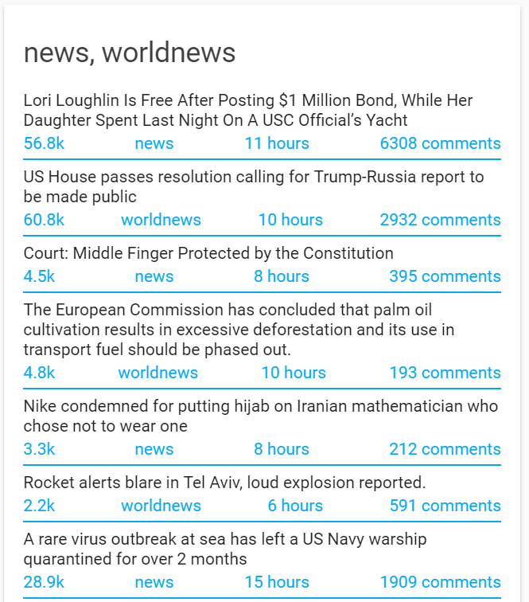

<h1 align="center">Reddit Card for Home Assistant</h1>

<p align="center">
  
</p>


<h2>Track Updates</h2>

This custom card can be tracked with the help of [custom-updater](https://github.com/custom-components/custom_updater).

In your configuration.yaml

```yaml
custom_updater:
  card_urls:
    - https://raw.githubusercontent.com/ljmerza/reddit-card/master/custom_updater.json
```

<h2>Options</h2>

| Name | Type | Requirement | `Default` Description
| ---- | ---- | ------- | -----------
| header | string or boolean | **Optional** | `list of subreddits` Custom header or set to `false` to disable
| entities | list | **Required** | List of reddit sensors to display
| new_tab | boolean | **Optional** | `true` open comments, subreddit, and link in new tab
| max | number | **Optional** | `10` max number of posts to show for each subreddit

<h2>Configuration</h2>

Download `reddit-card.js` from the [latest release](https://github.com/ljmerza/reddit-card/releases/latest/) and upload it your /www folder of your Home Assistant config directory.

In your ui-lovelace.yaml

```yaml
resources:
  - url: /local/reddit-card.js?track=true
    type: module
```

Add the custom card to views:

```yaml
views:
  - type: custom:reddit-card
    entities:
      - sensor.reddit_news
      - sensor.reddit_worldnews
    max: 3
```